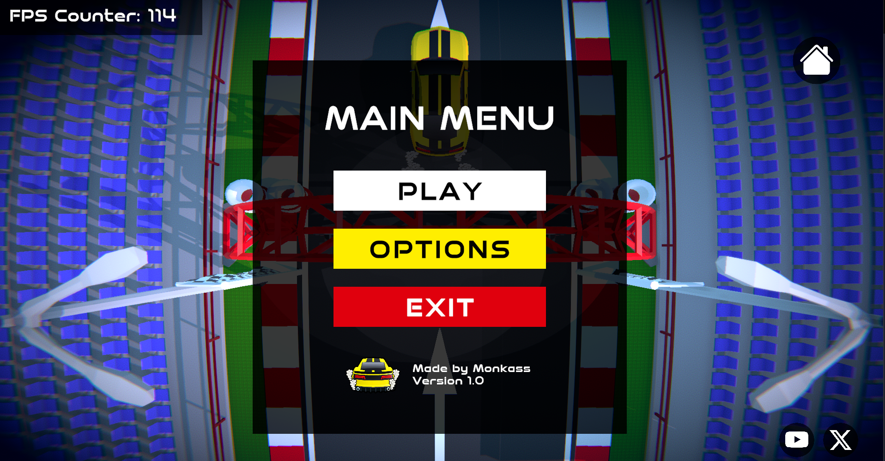

# 🎮 Wacky Wheels Game

Wacky Wheels is a **high-octane**, **physics-based driving game** that throws players into a whirlwind of absurd challenges and outrageous tracks! Race through chaotic, **obstacle-laden courses** filled with traps, and unpredictable hazards—where every turn could send you flipping, spinning, or soaring into hilarious disaster. Unlock a wild roster of **customizable vehicles**, each with unique handling and quirks, as you master increasingly insane levels designed to test your reflexes and creativity.

---

## 🛠️ Technologies Used

- **Unity**
- **Unity UI / UGUI (Interface Design)**
- **C#**
- **VS Code** (development IDE)

---

## 📄 License

This project is open-source.

---

## 🤝 Contributing

Pull requests are welcome! Please follow standard GitHub flow and keep the code clean and documented.

---

## 📬 Contact

For questions, contact me at [obrizanou@gmail.com](mailto:obrizanou@gmail.com) or open an issue.
